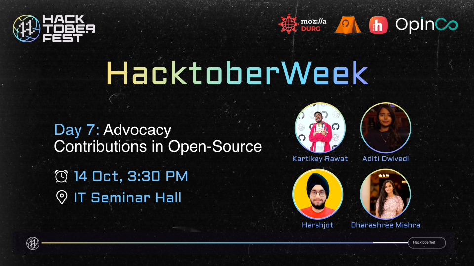

# Advocacy Contributions

  

## **Advocacy**
Supporting, defending, or arguing for a certain cause or topic is the act of advocacy.
Action-oriented advocacy entails pushing for change. It can entail doing research on fresh approaches, assembling groups of like-minded individuals, conducting public awareness campaigns, and much more.
It aids in the understanding and support of your cause by others.

Open-source contributing is a vast domain and starting out for the first time may be overwhelming, so we have tried to cater to each part of it by delivering the concepts more simply and inviting the contributors of the fields that will help the audience to contribute and know the tools! (all of it has been included in this repo.)

## **About HACTOBERWEEK: DAY 7**
Day 7 of the Hacktoberweek Series was all about Advocacy Contributions. 
The experienced speakers [Kartikey Rawat](https://www.linkedin.com/in/carrycooldude/), [Harshjot Singh](https://www.linkedin.com/in/harshjot-singh/), [Aditi Dwivedi](https://www.linkedin.com/in/aditi-dwivedi-500385201/), and [Dharashree Mishra](https://www.linkedin.com/in/dharashree-mishra-52abab190/) gave valuable insights covering everything from what is advocacy, how to contribute as well as where to contribute.

### **Resources and where to contribute:**
To ***get you started*** check these orgs out for quality contributions as well as first time PRs! 
To spread awareness, everything from how to contribute with live contributions and lists of organisations & projects are covered.

[Markodenic](https://github.com/markodenic/awesome-tech-blogs) 
[Dashee87](https://github.com/dashee87/blogScripts) 
[Microsoft](https://github.com/microsoft/BotFramework-BlogSamples) 
[vbrauer](https://github.com/vbrauer/android-blogs)

*We welcome all, regardless of gender or background, and not only aim to develop an urge to learn and widen knowledge but to also cultivate a sense of community spirit!*
 There will always be an additional edge to this because the active contributors play a crucial role in any project and their experiences will undoubtedly give a good kickstart to the enthusiasts!

## **Contributing Guidelines**

Make sure that you -

1. Start working on the pull request if and only if you are assigned the complimentary issue.
2. Create a good and valid PR. Go through the [Code of Conduct](https://github.com/OpInCo-Community/HacktoberWeek/blob/main/CODE_OF_CONDUCT.md) and follow the templates to avoid spam.
3. Make sure to go through [CONTRIBUTING.md](https://github.com/OpInCo-Community/HacktoberWeek/blob/main/Advocacy-Contributions/CONTRIBUTING.md) before raising a PR.

## **Connect With OpInCo!**

## Contributors:

