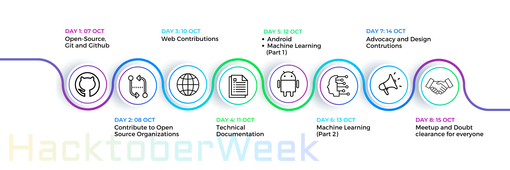

# HacktoberWeek

## **HACTOBERWEEK**
The week-long celebration of open-source & Hacktoberfest 2022!!

Targeting the concept “Open-source for everyone”, sessions of code, low-code as well as no-code have been organised to help the participant understand Open Source and kick start contributions with their domain of interest.Hacktoberweek is a platform to spread awareness and literacy about numerous open-source fields that are also included in this year’s hacktoberfest, everything from how to contribute with live contributions and lists of organisations & projects are covered.

We welcome all, regardless of gender or background, and not only aim to develop an urge to learn and widen knowledge but to also cultivate a sense of community spirit!

Opensource is a vast domain and starting out for the first time may be overwhelming, so we will try to cater to each part of it by delivering the concepts more simply and inviting the contributors of the fields that will help the audience to contribute and know the tools. There will always be an additional edge to this because the active contributors play a crucial role in any project and their experiences will undoubtedly give a good kickstart to the enthusiasts!

### **Domains included:**
- [Web Contributions](https://github.com/OpInCo-Community/OpInCo-Page/tree/6a3699f2a4a8315d6ade38ff9cdae7878aebabac)
- [Technical Documentation](https://github.com/OpInCo-Community/HacktoberWeek/tree/main/Technical-Documentaion)
- [Android](https://github.com/OpInCo-Community/HacktoberWeek/tree/main/Android-Contributions)
- [Design Contributions](https://github.com/OpInCo-Community/HacktoberWeek/tree/main/Design-Contributions) 
- [Advocacy](https://github.com/OpInCo-Community/HacktoberWeek/tree/main/Advocacy-Contributions)

## **Contributing Guidelines**

Make sure that you -
   
1. Start working on the pull request if and only if you are assigned the complimentary issue.
2. Create a good and valuable PR. Go through the [Code of Conduct](https://github.com/OpInCo-Community/HacktoberWeek/blob/main/CODE_OF_CONDUCT.md) and follow the templates to avoid spam.
3. Make sure to go through [contributing.md](https://github.com/OpInCo-Community/HacktoberWeek/blob/main/CONTRIBUTING.md) before raising a PR.

## **Connect With Us**

## Contributors:

