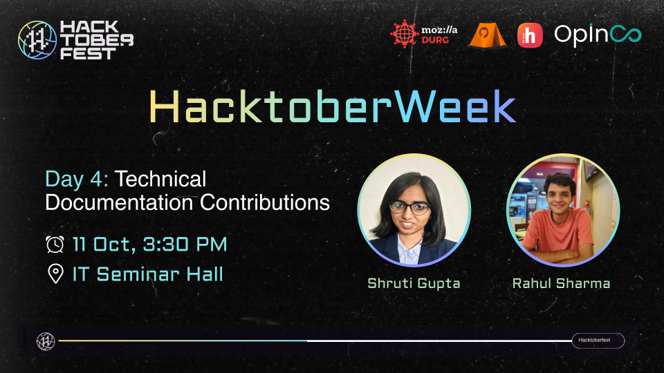

# Technical Documentation

## **DOCUMENTATION**
The fundamental information regarding the underlying architecture, materials, and procedure for interacting with or constructing on top of existing technology is referred to as [technical documentation](https://en.wikipedia.org/wiki/Technical_documentation). Documentation is required for all software development products, regardless of whether they were developed by a small group or a large corporation. 

*All the content fields including [copyediting](https://en.wikipedia.org/wiki/Copy_editing), [translation](https://en.wikipedia.org/wiki/Technical_translation#:~:text=Technical%20translation%20is%20a%20type,application%20of%20scientific%20and%20technological), [blogs](https://en.wikipedia.org/wiki/Blog), [markdown](https://en.wikipedia.org/wiki/Markdown) files etc fall under technical documentation domain.* 
Documentation was developed solely with the intention of making it simple for end users to comprehend a technology or product's architecture and work dynamics. 

Open-source contributing is a vast domain and starting out for the first time may be overwhelming, so we have tried to cater to each part of it by delivering the concepts more simply and inviting the contributors of the fields that will help the audience to contribute and know the tools! (all of it has been included in this repo.) 

## **About HACTOBERWEEK: DAY 4**
Day 4 of the hacktoberweek series was all about technical documentation contributions.  
The experienced speakers, [Shruti Gupta](https://www.linkedin.com/in/shrutiguptarkc/) and [Rahul Sharma](https://www.linkedin.com/in/rahul-sharma18/), gave valuable insights covering everything from what is documentation, how to contribute as well as where to contribute with hands-on sessions.

### **Resources and where to contribute:**
To ***get you started*** check these orgs out  for quality contirbutions as well as first time PRs! 
To spread awareness, everything from how to contribute with live contributions and lists of organisations & projects are covered.

[OpInCo](https://github.com/OpInCo-Community)  
[DigitalOcean Community](https://github.com/do-community)  
[freeCodeCamp](https://github.com/freeCodeCamp)  
[Moja Global](https://github.com/moja-global) 

*We welcome all, regardless of gender or background, and not only aim to develop an urge to learn and widen knowledge but to also cultivate a sense of community spirit!*
 There will always be an additional edge to this because the active contributors play a crucial role in any project and their experiences will undoubtedly give a good kickstart to the enthusiasts!

## **Contributing Guidelines**

Make sure that you -
   
1. Start working on the pull request if and only if you are assigned the complimentary issue.
2. Create a good and valid PR. Go through the [Code of Conduct](https://github.com/OpInCo-Community/HacktoberWeek/blob/main/CODE_OF_CONDUCT.md) and follow the templates to avoid spam.
3. Make sure to go through [CONTRIBUTING.md](https://github.com/OpInCo-Community/HacktoberWeek/blob/main/Technical-Documentaion/CONTRIBUTING.md) before raising a PR.

## **Connect With OpInCo!**

## Contributors:

